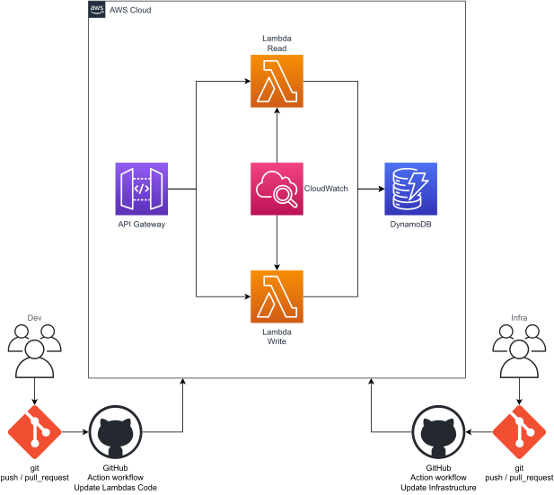
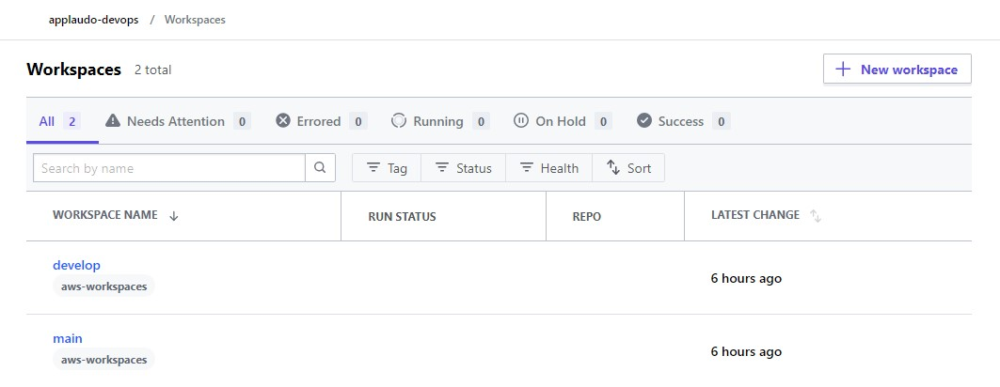
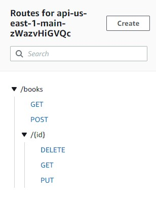
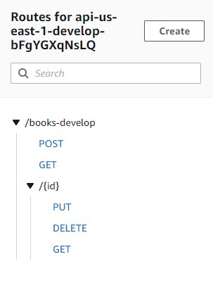

# AWS Lambdas

The goal of this repository is to automate the process of updating the AWS infrastructure through a GitHub action workflow using terraform.

## Architecture

The system's architecture is implemented on [AWS Cloud](https://aws.amazon.com/?nc1=h_ls) and consists of the following resources:

* 2 AWS Lambdas
* 2 CloudWatch Log groups
* 1 DynamoDB
* 1 API Gateway 

<div align=center>
    
</div>

## Terraform

To automate the creation of infrastructure, the first thing is to use an infrastructure-as-code solution, in this case, Terraform. The state is stored remotely using a terraform cloud organization and workspaces tagged as _"aws-workspaces"_. This can be seen in the following image:

<div align=center>
    
</div>

## Pipeline to Create or Update The Infrastructure

A GitHub context-based condition has been implemented to select which workspace to update, i.e. production or development. This is achieved through the following [workflow](.github/workflows/infra.yml):

```
name: Update aws infrastructure using terrafom

run-name: ${{ github.actor }} is updating the aws infrastructure 🚀

on:
  pull_request:
    types:
      [opened,synchronize,closed]
    branches:
      - develop
      - main
  push:
    branches:
      - develop

jobs:
  Update-infra:
    runs-on: ubuntu-latest
    steps:
      - name: Checkout
        uses: actions/checkout@v3

      - name: Install terraform
        uses: hashicorp/setup-terraform@v2
        with:
          terraform_version: 1.3.4
          cli_config_credentials_token: ${{ secrets.TF_API_TOKEN }}

      - name: Install aws
        uses: aws-actions/configure-aws-credentials@v1-node16
        with:
          aws-access-key-id: ${{ secrets.AWS_ACCESS_KEY_ID }}
          aws-secret-access-key: ${{ secrets.AWS_SECRET_ACCESS_KEY }}
          aws-region: us-east-1

      - name: Terraform fmt
        id: fmt
        run: terraform fmt -check
        continue-on-error: true

      - name: Terraform Workspace
        id: workspace
        run: |
          if [[ $GITHUB_EVENT_NAME == "pull_request" ]]; then
            echo "TF_WORKSPACE=$GITHUB_BASE_REF" >> $GITHUB_ENV
          else
            echo "TF_WORKSPACE=$GITHUB_REF_NAME" >> $GITHUB_ENV
          fi

      - name: Terraform Init
        id: init
        run: terraform init

      - name: Terraform Validate
        id: validate
        run: terraform validate -no-color

      - name: Terraform Plan
        id: plan
        run: terraform plan -no-color

      - name: Terraform Apply
        id: apply
        if: ${{ ( ( steps.plan.outcome == 'success' ) && ( github.event_name != 'pull_request' ) ) || ( github.event.pull_request.merged == true ) }}
        run: terraform apply -auto-approve

      - name: Terraform Output
        id: output
        if: ${{ success() && steps.apply.conclusion == 'success' }}
        run: terraform output -no-color

      - name: Summary
        if: ${{ success() && steps.apply.conclusion == 'success' }}
        run: |
          echo "## Terraform workspace" >> $GITHUB_STEP_SUMMARY
          echo "$TF_WORKSPACE" >> $GITHUB_STEP_SUMMARY
          echo "" >> $GITHUB_STEP_SUMMARY
          echo "## Terraform plan" >> $GITHUB_STEP_SUMMARY
          echo "${{ steps.plan.outputs.stdout }}" >> $GITHUB_STEP_SUMMARY
          echo "" >> $GITHUB_STEP_SUMMARY
          echo "## Terraform outputs" >> $GITHUB_STEP_SUMMARY
          echo "${{ steps.output.outputs.stdout }}" >> $GITHUB_STEP_SUMMARY
```

## Outputs

### API Gateway URL - Production

The URL to consume the resources is:

https://p58ybvz7v5.execute-api.us-east-1.amazonaws.com/

How ever the routes to access them are:

<div align=center>
    
</div>

### API Gateway URL - Dev

The URL to consume the resources is:

https://c9dlxhvnce.execute-api.us-east-1.amazonaws.com/develop

How ever the routes to access them are:

<div align=center>
    
</div>
